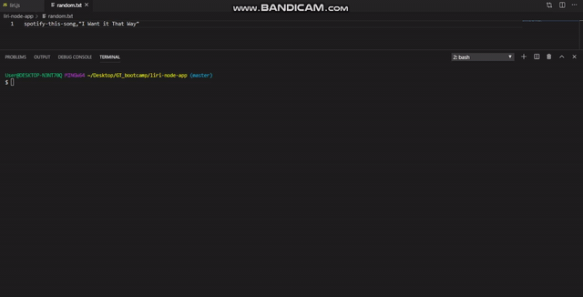

# Liri-Node-App

This is an app in order to find a concert, song, or movie. This program requires node.js in order to operate. All the user has to do is give a command with specifics about what they are looking for. 

## Getting Started:

This program runs on node.js only. Therefore, the user will have to interact directly with the terminal. All users need to have a program containing a terminal when downloading these files in order to interact with the app. I recommend Visual Studios. 

### Prequisites
In order to run this app, you must do the following:

    Go to Spotify : https://developer.spotify.com/my-applications/#!/
    create an .env file in project folder
    put your "Secret" and "ID" in .env file you just created, Copy below into .env file with your secret and id:

	SPOTIFY_ID=your-spotify-id                                          
	SPOTIFY_SECRET=your-spotify-secret                 

#2. Make sure to download the following in terminal in project folder.

### Installation Packages for using App
	> npm i fs                                                                                                     
	>npm i node-spotify-api                                                                    
	>npm i request                                                                                         
	>npm i moment                                                                                        
	>npm i axios                                                                                               
	>npm i inquirer    //This is only used if you want to run 	liriWithInquirer.js                                                                                  
### Running the Program

In order to run the program user must first type:
    >node liri
    
After typing "node liri" then the user must type one of the following commands:
    concert-this
    spotify-this-song
    movie-this
    do-what-it-says

Then the user must follow with specifics to the command.
    ie. >node liri movie-this Beauty and the Beast
    or  >node liri spotify-this-song On Top of the World

In order to bypass these steps then run the alternative file: 
    >node liriWithInquirer

    This will require you to install inquirer onto the program. Other than that it runs the same way but more user friendly.

## Examples of the Program Running

Concert-This commands in practice

Spotify-This-Song commands in practice

Movie-This commands in practice

Do-What-It-Says commands in practice

